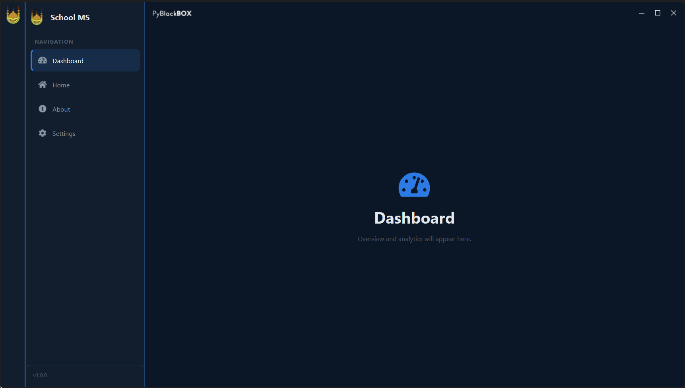

**PySide6-Application-Template**
An empty template build with python PySide6 lib ... Ready for used by any desktop application. It includes('sidebar','left-menu',and 'page view area')

This template changed and modified from Pyblackbox template


## Template UI Image



### Rebuilt resource.qrc with new addions
```bash
python -m PySide6.pyside6-rcc resources.qrc -o resources_rc.py
```